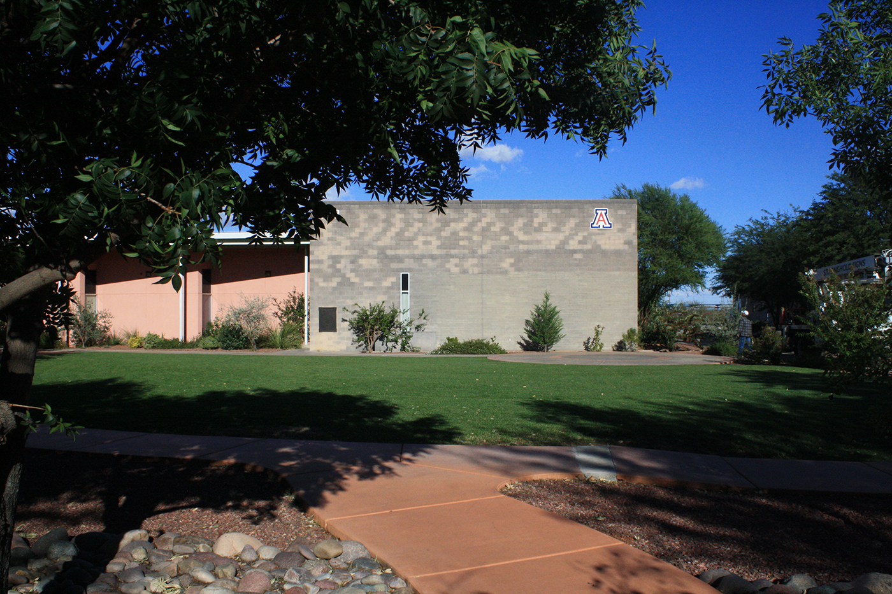
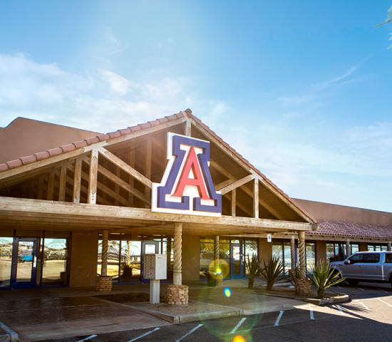

# Labs and Physical Spaces {#spaces}

The MA{VR}X Lab has two official physical spaces: one on the Sierra Vista campus and one on the Yuma campus (contact Dr. Saldana for information on this space).

## Sierra Vista

The MA{VR}X Lab's main location is room B158 on the [University of Arizona Sierra Vista campus](https://azcast.arizona.edu/about)^[Formerly UA South, the college was established in 2019 by the Arizona Board of Regents.]. It is part of the [College of Applied Science and Technology (CAST)](https://azcast.arizona.edu/locations). 

>>>1140 N. Colombo Avenue  
Sierra Vista, AZ 85635  
(520) 458-8278

### Hours

Generally speaking, the director is in the lab on Mondays. Given that the lab focuses on extended reality, much of the work can be done virtually unless the hardware in the room is specifically needed. Other hours throughout the week are determined by those employed by, volunteering, or researching in the lab.

## Yuma

(Info on the Yuma location coming soon!)

>>>7875 E. 24th St. Ste. #7  
Yuma, AZ 85365  
(928) 782-1914

## Other Locations

Plans to expand into other locations like Chandler are in the works.